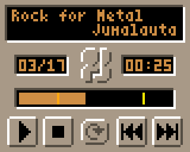

# Gamebuino Music Demo

This is a demo for the Music Generation functionality that I am adding to the library for the [Gamebuino][] console.
This code is currently available in a [local fork](https://github.com/erwinbonsma/Gamebuino-META.git).

[Download the demo player][MusicDemoGB].
You need a Gamebuino device to install it and hear the music.

Credits
-------
This code includes derivations of the following CC4-BY-NC-SA licensed material:

*   "Alex Kidd" songs by Domarius from PICO-8 game [Alex Kidd][]
*   "Bubble Bobble" songs by pahammond from PICO-8 game [Bubble Bobble][]
*   "Neon" song by Luca Harris from PICO-8 demo [Neon][]
*   "Porklike" song by Krystian Majewski from PICO-8 game [Porklike][]
*   "Rock for Metal" song by Jumalauta from PICO-8 demo [Rock for Metal][]
*   "Sweet Buns" songs by Krystian Majewski from PICO-8 game [Sweet Buns][]
*   "Techno Utopian Edict" song by Jumalauta from PICO-8 demo [Techno Utopian Edict][]
*   "The Lair" songs by Gruber Music from PICO-8 game [The Lair][]
*   "Wintergolf" songs by Gruber Music from PICO-8 game [Wintergolf][]

Also included:
*   "Bumble Bots" songs by Paul Bonsma (my brother) from PICO-8 game [Bumble Bots][]
*   "Garden of Life" song by Paul Bonsma from PICO-8 game [Pico Garden][]

[Gamebuino]: https://gamebuino.com
[Alex Kidd]: https://www.lexaloffle.com/bbs/?tid=30218
[Bubble Bobble]: https://www.lexaloffle.com/bbs/?tid=37748
[Bumble Bots]: https://www.lexaloffle.com/bbs/?tid=30250
[Neon]: https://www.lexaloffle.com/bbs/?pid=74526
[Pico Garden]: https://www.lexaloffle.com/bbs/?tid=46650
[Porklike]: https://www.lexaloffle.com/bbs/?tid=37045
[Rock for Metal]: https://www.lexaloffle.com/bbs/?tid=31747
[Sweet Buns]: https://www.lexaloffle.com/bbs/?tid=31864
[Techno Utopian Edict]: https://www.lexaloffle.com/bbs/?tid=33486
[The Lair]: https://www.lexaloffle.com/bbs/?tid=4051
[Wintergolf]: https://www.lexaloffle.com/bbs/?tid=31956

[MusicDemoGB]: https://gamebuino.com/creations/music-demo
